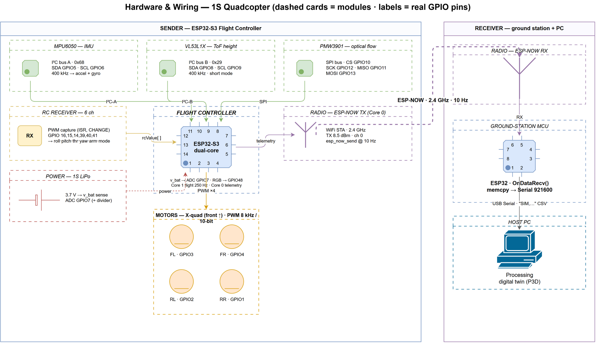
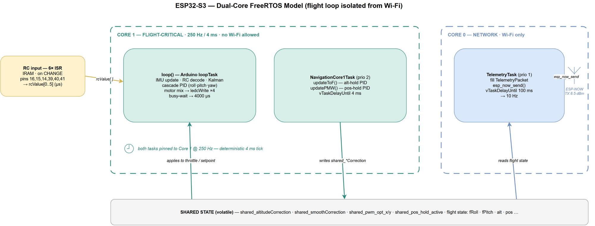
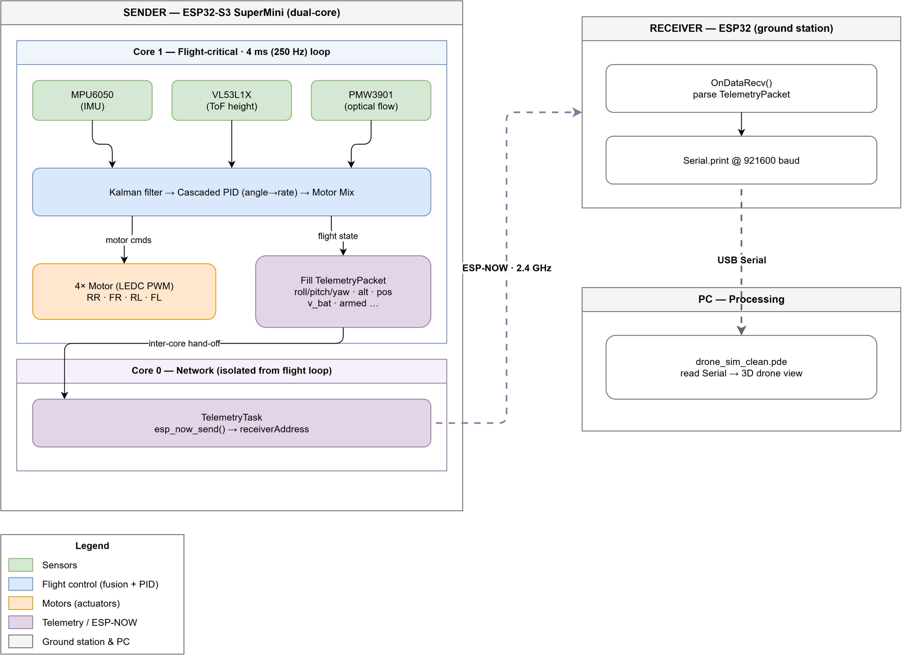
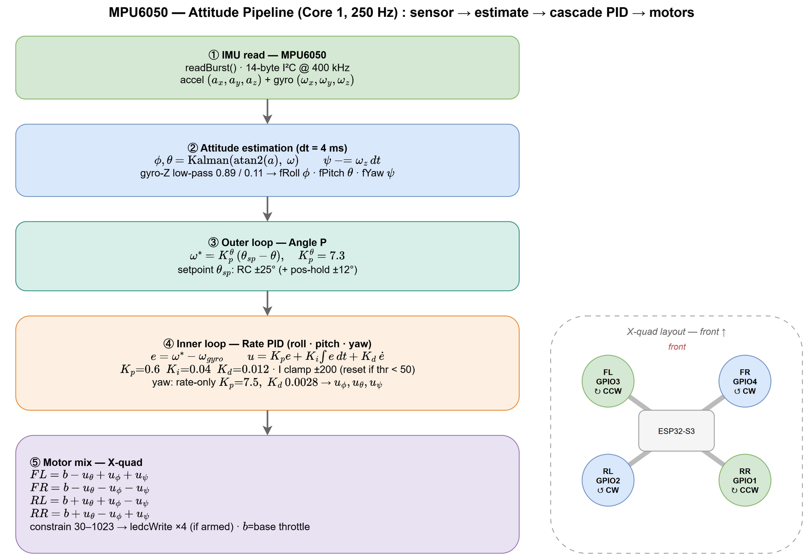
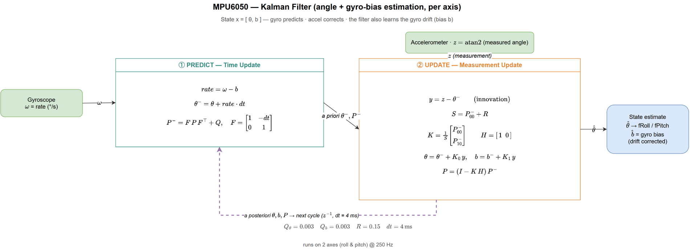
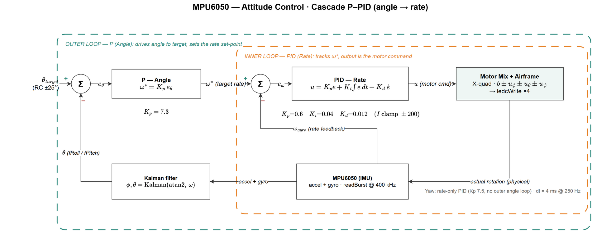
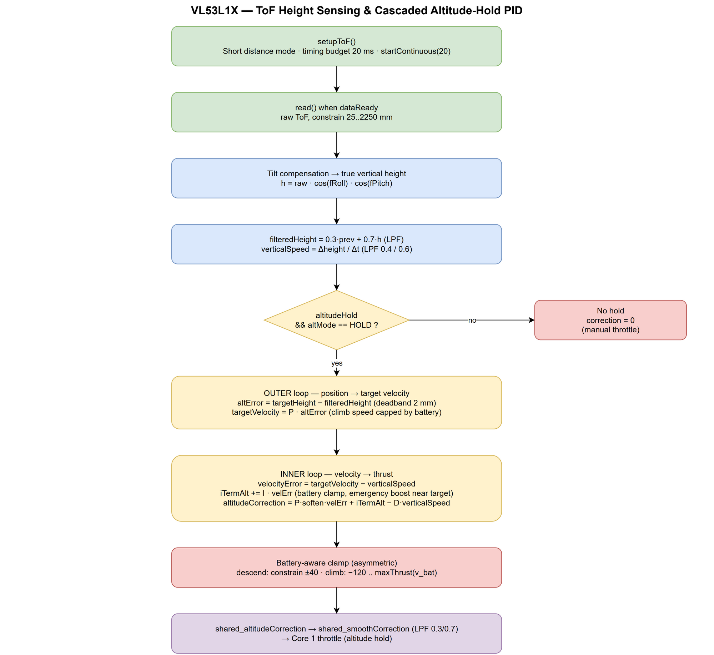
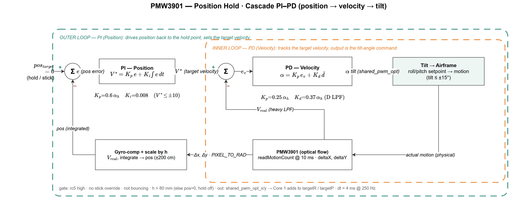
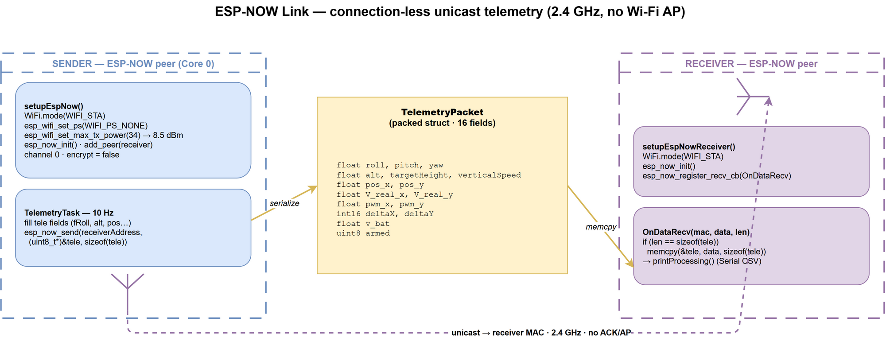
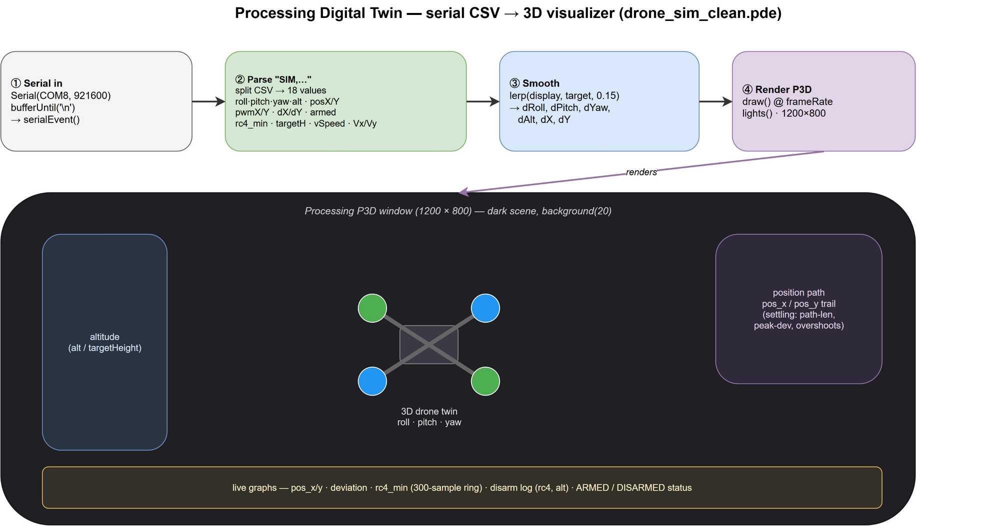

# ESP32-S3 1S Micro Quadcopter — Flight Controller

A single-cell (1S) micro quadcopter flight controller built on the **ESP32-S3 SuperMini**.
It fuses an IMU, a time-of-flight height sensor, and an optical-flow sensor with a Kalman
filter and a cascaded PID controller to fly stabilized, hold altitude, and hold position —
while streaming live telemetry to a ground station over ESP-NOW.

The repository has three parts:

| Part | Runs on | Job |
|------|---------|-----|
| **`sender/`** | ESP32-S3 SuperMini | The **flight controller** — sensors, state estimation, control, motors. |
| **`receiver/`** | ESP32 (ground station) | Receives ESP-NOW telemetry and forwards it over Serial. |
| **`processing/`** | PC (Processing IDE) | A 3D visualizer that animates the drone from live telemetry. |

> **Note:** `sender/sender.ino` is the **main sketch** — the program entry point (think of it
> as `main.ino`). It holds `setup()`, `loop()`, the RC input ISRs, `smartCalibrate()`, the
> Core-1 navigation task, and the PID + motor-mixing code.

---

## Wiring / Hardware Diagram



---

## Electrical Devices (Bill of Materials)

| Device | Role | Interface | Connection |
|--------|------|-----------|------------|
| **ESP32-S3 SuperMini** | Main MCU (flight controller) | — | Dual-core, Wi-Fi/ESP-NOW radio on-chip |
| **MPU6050** | 6-axis IMU (accel + gyro) → attitude | I²C (`I2C_IMU`) | SDA = GPIO5, SCL = GPIO6 @ 400 kHz |
| **VL53L1X** | Time-of-Flight distance → altitude | I²C (`I2C_TOF`) | SDA = GPIO8, SCL = GPIO9 @ 400 kHz |
| **PMW3901** | Optical-flow → horizontal position | SPI | CS = GPIO10, MOSI = GPIO13, SCK = GPIO12, MISO = GPIO11 |
| **4× DC motors** | Propulsion (X-quad) | PWM | GPIO1, GPIO4, GPIO2, GPIO3 (see motor order) |
| **RC receiver (6 ch)** | Pilot input (PWM capture) | Digital IN | GPIO16, 15, 14, 39, 40, 41 |
| **Battery + divider** | Pack voltage sense | ADC | GPIO7 |
| **WS2812 RGB LED** | Status indicator | NeoPixel | GPIO48 |
| **ESP-NOW radio** | Telemetry downlink | on-chip Wi-Fi | 2.4 GHz, connection-less |

### Motor order — get this right or the mix inverts
`motorPins[] = { 1, 4, 2, 3 }` maps to **RR, FR, RL, FL**:

| Slot | Position | GPIO |
|------|----------|------|
| 0 | **RR** — rear-right | 1 |
| 1 | **FR** — front-right | 4 |
| 2 | **RL** — rear-left | 2 |
| 3 | **FL** — front-left | 3 |

---

## System Architecture — Dual-Core, Hard Real-Time

The ESP32-S3's two cores are split so flight never waits on the radio:



- **Core 1 — flight-critical (250 Hz / 4 ms fixed loop):** reads MPU6050, VL53L1X, PMW3901;
  runs the Kalman attitude estimate; runs the cascaded PID; mixes and drives the motors.
  The loop busy-waits to a fixed 4000 µs period — no blocking work allowed here.
- **Core 0 — network:** the ESP-NOW telemetry task only (≈10 Hz), deliberately isolated from
  the flight loop so Wi-Fi jitter can never disturb control timing.
- **Handshake:** the two cores exchange data only through the `shared_*` volatile variables.

### Sender → Receiver → Visualizer data flow


---

## Flight Control

The full attitude pipeline — sensor read → Kalman estimate → cascaded PID → X-quad motor mix:



**Attitude estimation — Kalman filter** (per axis: angle + gyro-bias):



**Cascaded PID** — an outer angle (P) loop drives an inner rate (PID) loop:



| Gain | Value | Loop |
|------|-------|------|
| `PAngle` | 7.3 | Outer angle → rate setpoint |
| `PRate` / `IRate` / `DRate` | 0.6 / 0.04 / 0.012 | Inner roll & pitch rate |
| `PRateYaw` | 7.5 | Yaw (rate-only, no outer loop) |

Loop rate 250 Hz (`dt = 4 ms`). Altitude hold (VL53L1X) and position hold (PMW3901) add their
own PID corrections on top of attitude control.

---

## Altitude Hold — VL53L1X (Time-of-Flight)

Tilt-compensated ToF height is low-pass filtered, then a **cascaded PID** (position → velocity
→ thrust) with a battery-aware thrust clamp produces the altitude correction fed to Core 1:



## Position Hold — PMW3901 (Optical Flow)

Gyro-compensated optical flow is scaled by height into ground velocity and integrated into
position, then a **cascaded PID** (position → velocity → tilt angle) nudges the roll/pitch
setpoints to hold station:



---

## Repository Layout

```
.
├── sender/        # Flight-controller firmware (ESP32-S3) — sender.ino is the main sketch
├── receiver/      # Ground-station firmware (ESP32) — ESP-NOW receive + Serial forward
├── processing/    # 3D telemetry visualizer (Processing .pde)
├── assets/        # Architecture & algorithm diagrams (.drawio + .png)
└── docs/
    ├── datasheets/ # Component datasheets (PDFs)
    └── research/   # Research papers & scientific references
```

### Firmware modules (`sender/`)
| File | Responsibility |
|------|----------------|
| `sender.ino` | **Main sketch:** setup, RC ISRs, `smartCalibrate()`, Core-1 nav task, PID + motor mix |
| `Config.h` | Shared declarations: pins, `TelemetryPacket`, all `extern` globals |
| `Globals.cpp` | The single definition of every global |
| `MPU6050.*` | IMU driver (`HungVo_IMU` class) |
| `VL53L1X_Sensor.*` | ToF height + altitude-hold PID |
| `PMW3901_Sensor.*` | Optical flow + position-hold PID |
| `ESPNow_Telemetry.*` | Core-0 telemetry task, ESP-NOW send |

### Receiver modules (`receiver/`)
| File | Responsibility |
|------|----------------|
| `receiver.ino` | Main sketch: ESP-NOW init + receive loop |
| `ESPNow_Receiver.*` | ESP-NOW callback, unpack `TelemetryPacket` |
| `Processing.*` | Format + stream telemetry over Serial to the Processing app |

---

## Telemetry Packet (wire format)

Sender and receiver must agree on this struct **byte-for-byte** (`TelemetryPacket` in
`sender/Config.h`):

```c
typedef struct {
  float   roll, pitch, yaw;      // attitude (deg)
  float   alt;                   // filtered height (m)
  float   targetHeight;          // altitude-hold setpoint
  float   verticalSpeed;         // climb/descent rate
  float   pos_x, pos_y;          // optical-flow position
  float   V_real_x, V_real_y;    // estimated velocity
  float   pwm_x, pwm_y;          // position-hold PID output
  int16_t deltaX, deltaY;        // raw optical-flow deltas
  float   v_bat;                 // battery voltage
  uint8_t armed;                 // arm state
} TelemetryPacket;
```

### ESP-NOW link
Connection-less 2.4 GHz unicast — the sender packs the struct and `esp_now_send`s it 10×/s;
the receiver's `OnDataRecv` callback validates the length and `memcpy`s it back:



### Ground-station visualizer (Processing)
The receiver forwards each packet over USB Serial as a `"SIM,…"` CSV line; the Processing
sketch parses it into a live 3D digital twin — attitude, altitude, position path, and graphs:



---

## Build & Flash

Arduino / PlatformIO-style C++ on the ESP32 Arduino core (FreeRTOS underneath).

1. Install the **ESP32 Arduino core** and select **ESP32-S3** as the board.
2. Install libraries: `VL53L1X`, `Adafruit_NeoPixel`, `Kalman` (Lauszus/TKJ), `Bitcraze_PMW3901`.
3. Open **`sender/sender.ino`** (the main sketch) → flash to the ESP32-S3 flight controller.
4. Open **`receiver/receiver.ino`** → flash to the ground-station ESP32.
5. Open **`processing/drone_sim_clean.pde`** in the Processing IDE and run it to visualize.

> Firmware comments are written in Vietnamese; match that style when editing the flight code.
